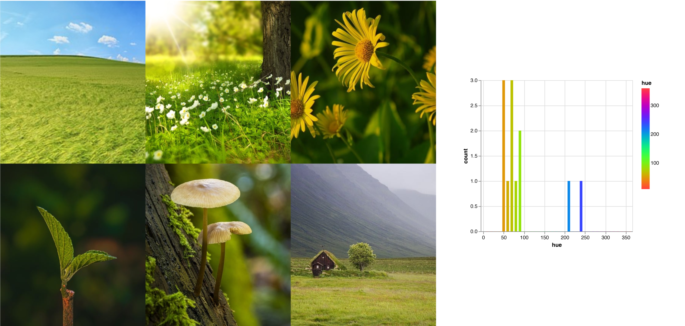

# huestogram.py
A small python based script to analyse predominant colors in collections of images



## About
-----

Created this cool little script some time ago to analyse the main colors of a few brands, and thought it looked pretty useful. It uses the awesome [color-thief](https://github.com/fengsp/color-thief-py) and [Vega-Altair](https://github.com/vega/altair) libraries to extract the dominant colors of images in a folder and visualize them on a histogram using HSB scale. It plots only the **pure hue values** (hence the name huestogram) right now, so it doesn't take into account saturation and brightness. It also **outputs the results on an SVG file**, which can be viewed and edited on loads of different sotware.

## Usage
-----

You can use the script directly from the command line. It can take three parameters:

```
  	-b, --bins  	Number of subdivisions (bins) on the HSL scale. Default value is 36.
  	-p, --path		Path to a directory containing images to be analyzed. Searches for PNG and JPG files images only.
  	-c, --colors 	How many dominant colors to extract for each image file. Default value is 4.
```


## Next steps
-----

- [x] Finish translating comments to english.
- [ ] Optimize the `generate_histogram` function. Right now it has to go through all hues for each iteration of the outer loop, even though smaller values have already been alocated. It's not a big deal right now, but on larger lists it might be.
- [ ] Add a parameter to allow the user to output to a different format other than SVG without modifying the code.
- [ ] Experiment with plotting results on a polar chart, to better convey the cyclical nature of the HSB colorspace.
- [ ] Try a 3-axis chart so that you can see more information about the color, either Saturation or Brightness. Either that or generating three different histograms and presenting them side-by-side.
